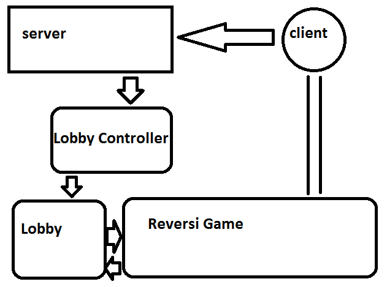
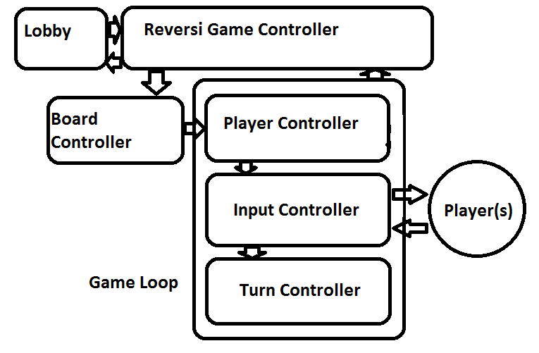

Design Document
===============

## Purpose of Project

The goal is to create a Reversi game. This game will focus on an audience which is interested in turn-based strategy board games. The game will be implemented through a client/server system, so that players will be able to play against AI and other human opponents through interaction with the game lobby. Players not wanting or unable to play using the client server system, will be allowed to play in stand-alone mode through the client itself. Throughout the project, experience will then be gained in both AI algorithms as well as Server-Client programming. Additionally, designing a high-quality GUI for the game will be a high priority toward the delivery of the final game. The game will follow traditional Reversi rules found on the [Reversi wiki page](http://en.wikipedia.org/wiki/Reversi) as referenced by the [Project Instructions](http://courses.cs.tamu.edu/choe/13fall/315/proj2.html).

## High Level Entities

The three main entities are the Server, Client and Game loop. 

The server will be the entry point for clients. They will be placed into a lobby and the game will begin once the user has selected their preferred settings.

The lobbies are run in separate, contained threads that handle creating and running the game's logic.

The game runs in a simple loop that uses several controller components that handle input, updating, and scoring.

The stand-alone client will implement a GUI to send responses to the server, but communication will remain the same for the most part.

## Low Level Entities

### Server
While the server class handles connecting clients, a Lobby Controller is used for figuring out what Lobby to place a player into. 
For a singleplayer Reversi game, this means creating a new Lobby and placing the user into that lobby. For a multiplayer Reversi game, the controller spawns a small task to take the user's input for the lobby they want to join.

The Lobby Controller is run on a separate thread to keep the server from locking up while waiting for user input for multiplayer games, but for singleplayer the clients are sent to a new Lobby. 
Created lobbies are given a `GameFactory` instance that allows them to create a gameboard using the Lobby settings.

If the user runs an AI vs AI command using a remote server, that user will recieve changes processed by the server. This is done by adding the client as a player, but skipping their input each turn.

### Game
Once all players are ready, the game will begin and the `GameFactory` delegate is used for creating a new game. The newly created `ReversiGame` is run in the same loop as the lobby.
First a new board is created by the `BoardController`, then the main gameloop begins which cycles first to the `PlayerController` to update the score. 
The `InputController` follows, and is used to retrieve Input from players; in Reversi, this means a single player per turn. The `InputController` uses two delegates to handle human and AI input.
The `TurnController` comes last, updating the board and players using the Input created from the `InputController`. The `TurnController` is responsible for handling the Undo function as well, so the `ReversiTurnController` will capture all `ReversiTokens` for the last several turns in a single-linked list.

Once the game ends or the player(s) want to end/restart their game, control will return to the lobby loop. 

### Network
The gameloop will communicate minimally with the remote clients, asking only for coordinates. 

Full range of client requests:
`command | move | comment`

Client Commands:
`EXIT | DISPLAY | difficulty | UNDO | HUMAN-AI | AI-AI <server> <port> difficulty difficulty | HUMAN-HUMAN <lobby>`

Full range of server responses: 
`WELCOME | OK | column row | ILLEGAL | comment`

The client will have to specify the `DISPLAY` in order to not recieve ASCII GUI responses.

## Benefits, Assumptions, and Risks

###Benefits 
Highly modular design that allows for easy implementation of different AI's and rules. We could easily modify reversi with additional rules, or modes. This modularity will allow multiple play styles and difficulty settings to be implemented easily by the user via the GUI. The server will be able to handle multiple clients all running different games and settings as well as opponent matching in the lobby. This feature will enable the user/s to compete against eachother through the server from remote locations.

###Assumptions
Currently the design assumes that clients who connect will be able to use the response data. It is also assumed that players will know how to play reversi as no help will be provided in game.

###Risks
While any user may be able to connect via telnet at play that way, other standalone clients may not work depending on the InputController's `HumanInputController` implementation.
If the other client cannot communicate properly, the game loop may become locked after recieving strange input. If special rules/boards are implemented, clients may become out of sync. Individual clients may need to pay some attendtion to their network security suits to allow access over the ports required to connect.

